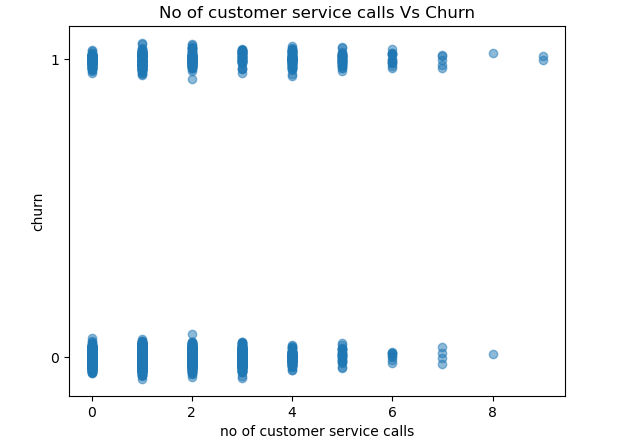
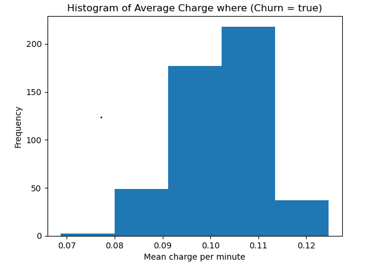
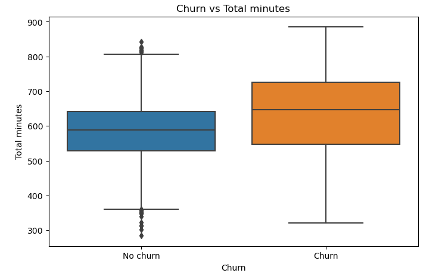
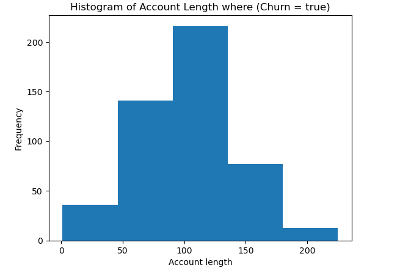

**BUILDING A PREDICTIVE MODEL FOR CUSTOMER CHURN FOR SYRIATEL** by Stephen Jilani

**Overview**
The project aims to develop a predictive model that will help SyriaTel in predicting customer churn so that to employ proactive measures for customer retention. This is by combining aspects both financial and non-financial about their historical clients to determine any trends as to why customers end up leaving and procuring the services of competitor firms.

**BUSINESS UNDERSTANDING**
The questions that are attempted to be answered are as below. These are the questions that the stakeholders are expecting to answer. The stakeholders at SyriaTel are: Customer retention teams, marketing and business development teams and business decision makers.

1. Are there any trends in the data presented?
2. Are the trends predictive of the possibility and reasons for customer churn?

**DATA UNDERSTANDING, PREPARATION AND CLEANING**
Data Source: The data was obtained from Kaggle and the link is below;
https://www.kaggle.com/becksddf/churn-in-telecoms-dataset

**DATA PREPARATION**
We started by importing the necesarry libraries into our notebook, then headed to load the SyriaTel Churn dataset.

We checked for the descriptive statistics for the dataset just to get a better understanding. This was followed by checking for duplicates and missing values. Fortunately, the dataset was fairly clean and we proceeded with EDA to get insights that were relevant to our project.

We prepares visualizations from the raw data to see if there were relationships between the features of the dataset and customer churn. Some of the vizualizations and their accompanying insights are listed below.

The plot above shows a relationship between customer service calls and churn rate. There are clients that end up churning even where there are zero calls to customer service probably due to different reasons other than customer service calls. However, as the number of calls to customer service increase, the churn rate fluctuates up and down untl a point where it reduces. This shows that as much as clients leave the company due to high customer service calls, most of them don't stay to a point where the recurring calls have exceed 5 leading to the churn rate reducing as the calls to customer service increase.

The histogram above shows 2 things:
1. That as the average charge per minute increases, there is higher customer churn.
2. That there is inconsistency in how cusstomers are charged in the company and that may be the reason for the alarming churn rate in the company.

The box plot show that the median of the churn customers is higher than that of the no churn customers. This may be a suggestion that the heavy users are the ones that end up leaving the companny probably due to lack of satisfaction, heavy bills or even higher service constraints.

There is also a bigger spread in the churn customers indicating that there is some randomness in the way customers churn in relation to total minutes. There are also more outliers in the churn clients which suggests possibility of other factors that lead to customer churn.

The histogram above shows the relationship between the account length and churn rate. We can see that most of the customers leace the company between the 100th and the 150th day of procuring the company's services.The company  should then focus mostly on the clients in this and the categories before in order to ensure that they do not churn.

The plots showed that:
1. Customers with average charges that are high churn more
2. customers mostly spend around 100 days before leaving the company for a variety of reasons
3. There is inconsistency on how the company charges its customers

We then selected our relevant columns for the project and created our final dataset that was to be used for modelling.

**DATA MODELLING**
We started with a basic dummy model to see if our model works at a basic model and also form a baseline to improve from

**Model 1: Logistic Regression**
This being a simple model was selected to be the basic model and form basis for comparison with the more complex models that are to come next in the project.

The limitations below led to us improving on the logistic regression model into a decision tree:
1. Logistic regression asssumes a linear relationship
2. logistic regression is not good for mixed data types

The decision trees are meant to mitigate the limitations mentioned above.

**Model 2: Decision Trees**
The decision tree model outperformed the logistic regression model as inidicated in the metrics below:

The model comapred to the basic logistic regression model has a recall rate of 69% on the churn customers compared to 0.23; it also has a precision of 95% compared to 64%. The f1 score has also improved from 34% to 80%. This is an indication that it surpasses the basic logistic regression model built above.

The decision trees however have their limitations which are listed below such that a more complex model calld RandomForest was used:

**Limitations of Decision Trees**
- Decision trees are more sensitive to outliers and random fluctuations.
- Decision trees may not be good in capturing complex relationships
- Decisions trees use one model/tree which makes it sensitive.

**Model 3:Random Forest**
The Random Forest model was to improve on the decision tree model, however, the evaluation metrics were identical to the decision tree model above.

**FINAL MODEL SELECTION**
After review of the 3 models, the Random Forest Model was selected to be the final model due to its natural ability to predict real world scenarios. The reason for this is that the evaluation metrics between the Random Forest model and the Decision Tree model were identical and could not form a reliable basis for choosing the better model.

Despite the evaluation metrics being identical between the Random Forest and Decision Tree models, the performance metrcis for churn cases were as below:

Accuracy: 0.95 Recall: 0.69 Precision: 0.96

The recall being the priority here, this means that the model will flag 69% churn customers correctly and the company will be able to employ retention strategies leading to a reduced churn rate.

**FINAL MODEL EVALUATION**
On the hold out test set, we conducted evaluation of our final model.

The performance metrics were as below:
Recall  for churners: 59%
Precision for churners: 93%
Accuracy: 93%

What has been considered in the classification report of the final model is the churn rate of 59% on the churn customers. This is to say that the model will correctly predict approximately 59% of the customers who are to churn soon. It also has to be consodered that the model has a precision of 93% on the churn clients and an accuracy of 93%.

**FEATURE IMPORTANCE**
This was to ascertain which factors in the dataset were the major drivers of churn to fuel business recommendations. The feature importance was as below: 

total charge              0.332860
total minutes             0.177135
customer service calls    0.170120
average charge            0.113995
account length            0.076440

The business recommendations were then provided as below based on feature importance:

**BUSINESS RECOMMENDATIONS**
Based on the model insights:

1. The company should target customers with high total charges and employ retention measures like incentives so that they do not end up churning.
2. Clients with high amounts of minutes should also be targeted for retention measures.
3. Clients with high customer service calls also need to be addressed to reduce their churn rate.
4. Clients with higher average charge may need to be given incentivised packages to ensure retention
5. Target to reach out to clients as they approach more than 3 months with the company.

**EXPECTED IMPACT**
1. Reduced churn rate
2. Improved customer satisfaction

**LIMITATIONS**
- The dataset may not consider all factors influencing churn like competitor pricing or behavior
- Class imbalance may affact the performance of the model
- The use of historical data which may not be applicable to the future.